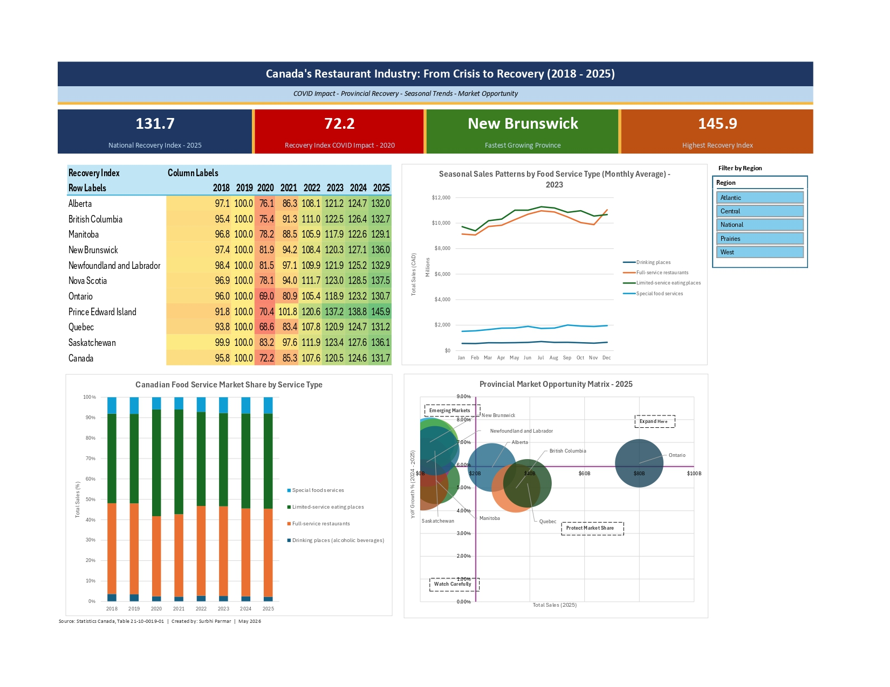

# Canadian Food Service Industry Analysis (2018–2025)

**COVID Impact · Provincial Recovery · Seasonal Trends · Market Opportunity**

> Built on official Statistics Canada data.

---

## Project Overview

This project analyzes Canada's food service industry using monthly sales data from Statistics Canada (Table 21-10-0019-01) covering January 2018 to December 2025. The dataset captures seasonally adjusted revenue across all provinces and four service categories - full-service restaurants, limited-service eating places, drinking places, and special food services.

The goal was to answer four real business questions that a regional restaurant chain's operations or strategy team would genuinely care about:

- Which provinces recovered from COVID fastest, and which are still lagging?
- When does each type of food service peak and trough through the year?
- Is the Canadian market shifting from full-service to limited-service dining post-COVID?
- Which provinces offer the best combination of market size and growth momentum for expansion?

---

## Dashboard Preview



---

## Tools & Skills Demonstrated

| Category | Skills |
|---|---|
| **Data Import** | Power Query - multi-file import, connection-only load, Add to Data Model |
| **Data Cleaning** | Power Query - date extraction, data type correction, null handling, column removal |
| **Data Modelling** | Power Pivot - star schema, many-to-one relationships, Data Model |
| **DAX Measures** | CALCULATE, ALLEXCEPT, SAMEPERIODLASTYEAR, DIVIDE, FILTER, VAR/RETURN |
| **Lookups** | XLOOKUP - basic and multi-condition composite key, structured table references |
| **Classification** | Nested IF - analyst-defined growth tier thresholds |
| **Visualisation** | PivotTables from Data Model, Conditional Formatting (color scale + rules), Line Chart, 100% Stacked Bar, Bubble Chart |
| **Dashboard** | Interactive dashboard with cross-connected Region slicer, KPI cards, linked charts |

---

## File Structure

```
Canada_FoodService_Analysis.xlsx
│
├── Raw_Data                  → Original Stats Canada CSV loaded via Power Query (untouched)
├── Province_Lookup           → Manually built dimension table with Region and Population Group
├── Province_Summary          → XLOOKUP demo - basic and multi-condition, nested IF, conditional formatting
├── Analysis_1                → Recovery Index heatmap by province (2018–2025)
├── Analysis_2                → Seasonal sales patterns by service type (2023)
├── Analysis_3                → Market share shift —-full-service vs limited-service (2018–2025)
├── Analysis_4                → Provincial Market Opportunity Matrix - bubble chart
└── Dashboard                 → Interactive dashboard with KPI cards, 4 charts, Region slicer
```

---

## Data Source

**Statistics Canada, Table 21-10-0019-01**
Monthly Survey of Food Services and Drinking Places - Seasonally Adjusted

- Official federal government data, updated monthly
- Downloaded as CSV - no account or API key required
- Direct download: `https://www150.statcan.gc.ca/n1/tbl/csv/21100019-eng.zip`
- Metadata reviewed before import to understand data suppression flags (STATUS column)
- Suppressed values already reflected as nulls in the VALUE column - retained as nulls rather than removed to avoid silently distorting provincial totals

---

## Methodology

### 1. Power Query - Data Cleaning

The raw CSV was imported and cleaned through 11 documented transformation steps, all visible in the Applied Steps panel for full auditability:

- Filtered to **2018 onwards** using Date Filters (keeping pre-COVID baseline, COVID crash, and recovery periods)
- Removed 9 unnecessary metadata columns after reviewing each one's purpose in the Stats Canada documentation
- Extracted `Year`, `Month_Number`, and `Month_Year` label from the REF_DATE date column
- Changed VALUE column data type to Decimal Number — nulls left in place intentionally
- Renamed columns to descriptive names: `Sales_Thousands`, `Service_Type`, `GEO`
- Loaded as **connection only → Add to Data Model**

### 2. Data Enrichment - Province Lookup Table

A `Province_Lookup` table was manually created and added to the Data Model, enriching the raw data with two dimensions not present in the original dataset:

- `Region` - West, Central, Prairies, Atlantic, National
- `Population_Group` - Large, Medium, Small

This enabled the Region slicer on the dashboard and the XLOOKUP demonstrations on the Province Summary sheet.

### 3. Power Pivot - Star Schema Data Model

Two tables connected via `Province_Code` in a many-to-one relationship:

```
FoodService_Adjusted (fact table)  →→→  Province_Lookup (dimension table)
     [many rows of sales data]              [11 province records]
           via GEO column                   via Province_Code column
```

This is the standard star schema structure used in professional BI tools including Power BI.

### 4. DAX Measures

Four measures were created in the Power Pivot measure grid:

**Total Sales**
```
Total Sales:=
CALCULATE(
    SUM([Sales_Thousands]),
    'FoodService_Adjusted'[Service_Type] = "Total, food services and drinking places"
) * 1000
```
Filters to the total NAICS category only — prevents double counting from individual subcategory rows.

**YoY Growth %**
```
YoY Growth %:=
DIVIDE(
    [Total Sales] - CALCULATE([Total Sales], SAMEPERIODLASTYEAR('FoodService_Adjusted'[REF_DATE])),
    CALCULATE([Total Sales], SAMEPERIODLASTYEAR('FoodService_Adjusted'[REF_DATE]))
)
```

**vs 2019 Baseline %**
```
vs 2019 Baseline:=
VAR Baseline2019 = CALCULATE(
    [Total Sales],
    FILTER(
        ALLEXCEPT('FoodService_Adjusted', 'FoodService_Adjusted'[GEO]),
        'FoodService_Adjusted'[Year] = 2019
    )
)
RETURN DIVIDE([Total Sales] - Baseline2019, Baseline2019)
```
`ALLEXCEPT` preserves the province filter while replacing the year filter with 2019 — ensuring each province compares to its own 2019 baseline, not the national total.

**Recovery Index**
```
Recovery Index:=
VAR Baseline2019 = CALCULATE(
    [Total Sales],
    FILTER(
        ALLEXCEPT('FoodService_Adjusted', 'FoodService_Adjusted'[GEO]),
        'FoodService_Adjusted'[Year] = 2019
    )
)
RETURN DIVIDE([Total Sales], Baseline2019) * 100
```
Score where 100 = fully recovered to 2019 levels, below 100 = still lagging, above 100 = exceeded pre-COVID levels.

### 5. XLOOKUP - Basic and Multi-Condition

**Basic XLOOKUP** - pulls Region from Province_Lookup:
```excel
=XLOOKUP(A2, Province_Lookup[Province_Code], Province_Lookup[Region], "Not Found")
```

**Multi-condition XLOOKUP** - retrieves 2024 total sales by combining three lookup keys:
```excel
=XLOOKUP(
    A2 & "2024" & "Total, food services and drinking places",
    FoodService_Adjusted[GEO] & FoodService_Adjusted[Year] & FoodService_Adjusted[Service_Type],
    FoodService_Adjusted[Sales_Thousands],
    "No data"
) * 1000
```

**Nested IF - Growth Tier Classification**
```excel
=IF(F2>0.35, "Exceptional Growth", IF(F2>0.25, "Strong Growth", "Moderate Growth"))
```
Thresholds were set based on the actual data distribution (20%–46%) rather than generic defaults.

---

## Key Findings

| Finding | Value |
|---|---|
| National Recovery Index 2025 | **131.7** - industry 31.7% above pre-COVID levels |
| COVID lowest point | **72.2** national average in 2020 |
| Strongest recovered province | **PEI - 145.9** (driven by domestic tourism surge) |
| Fastest YoY growth 2025 | **New Brunswick - +13.54%** |
| Only declining province 2025 | **Manitoba - -2.81%** |
| BC 2025 momentum | **+10.76%** - strongest large-market performer |
| Market structure shift post-COVID | **None** - full-service vs limited-service shares stable within 2-3% |

---

## Provincial Market Opportunity Matrix (2025)

| Quadrant | Provinces | Strategic Implication |
|---|---|---|
| **Expand Here** | Ontario, BC | Large markets, above-average growth |
| **Emerging Markets** | New Brunswick, Nova Scotia, Newfoundland | Small but fast-growing |
| **Protect Market Share** | Quebec | Large market, growth moderating |
| **Watch Carefully** | Manitoba, Saskatchewan | Below-average growth or declining |

---

## Analyst's Perspective

Three insights that go beyond the numbers:

**1. The recovery story overstates volume recovery**
The national Recovery Index of 131.7 includes significant menu price inflation (approximately 20-30% between 2019 and 2024). A more complete analysis would deflate these figures against Statistics Canada's CPI for food purchased from restaurants - the real volume recovery is likely more modest than the nominal figure suggests.

**2. PEI's 145.9 index needs context**
PEI's exceptional recovery is tourism-driven, not organic local market growth. As international travel normalises post-COVID, this tourism dividend may not be permanent. Operators evaluating PEI for expansion based on this metric alone would be misreading the signal.

**3. Manitoba's decline is the most actionable finding**
As the only province with negative YoY growth in 2025, Manitoba is a signal for existing operators to shift from growth to defence - renegotiate leases, tighten cost controls, evaluate underperforming locations before the decline deepens.

---

**Author:** Surbhi Parmar
**Portfolio:** [surbhiparmar01.github.io](https://surbhiparmar01.github.io/SurbhiParmar.github.io/)
**LinkedIn:** [linkedin.com/in/surbhiparmar](https://www.linkedin.com/in/surbhiparmar/)

---

*Source: Statistics Canada, Table 21-10-0019-01 - Monthly Survey of Food Services and Drinking Places*
